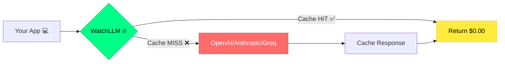
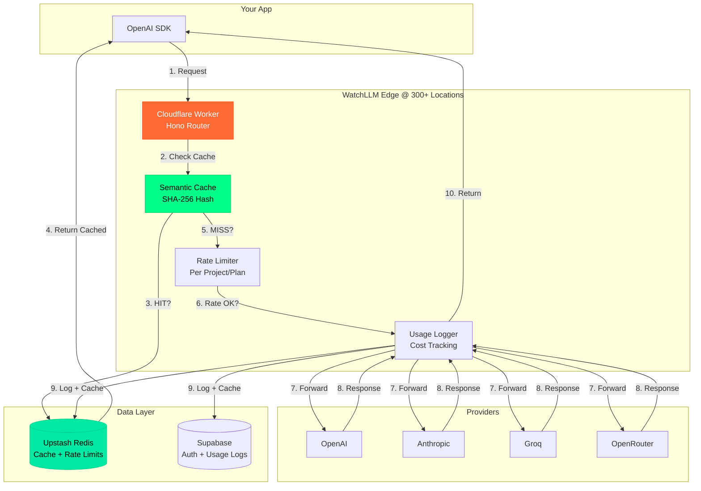

<div align="center">

```ascii
██╗    ██╗ █████╗ ████████╗ ██████╗██╗  ██╗██╗     ██╗     ███╗   ███╗
██║    ██║██╔══██╗╚══██╔══╝██╔════╝██║  ██║██║     ██║     ████╗ ████║
██║ █╗ ██║███████║   ██║   ██║     ███████║██║     ██║     ██║╚██╔██║
██║███╗██║██╔══██║   ██║   ██║     ██╔══██║██║     ██║     ██║╚██╔╝██║
╚███╔███╔╝██║  ██║   ██║   ╚██████╗██║  ██║███████╗███████╗██║ ╚═╝ ██║
 ╚══╝╚══╝ ╚═╝  ╚═╝   ╚═╝    ╚═════╝╚═╝  ╚═╝╚══════╝╚══════╝╚═╝     ╚═╝
```

### *Cut AI costs by 70% with semantic caching • Drop-in OpenAI replacement*

[](https://watchllm.dev)
[](https://proxy.watchllm.dev)
[](https://twitter.com/kaadz_zz)

[](https://twitter.com/kaadz_zz)
[](https://github.com/kaadipranav/WATCHLLM)

</div>

---

## 🎯 One Change. Massive Savings.



<div align="center">

**Before:** `baseURL: "https://api.openai.com/v1"` 💸 **$600/mo**  
**After:** `baseURL: "https://proxy.watchllm.dev/v1"` 💰 **$180/mo**

### **→ $420 saved/month** • **70% cost reduction** • **Zero code changes**

</div>

---

## ⚡ Live in 60 Seconds

<table>
<tr>
<td width="50%">

### JavaScript
```javascript
const OpenAI = require('openai');

const client = new OpenAI({
  apiKey: 'lgw_proj_xxxxx', // 👈 Your WatchLLM key
  baseURL: 'https://proxy.watchllm.dev/v1'
});

const response = await client.chat.completions.create({
  model: 'gpt-4o',
  messages: [{ role: 'user', content: 'Hello!' }]
});

// Check if cached
console.log(response.headers['x-cache']); // HIT or MISS
```

</td>
<td width="50%">

### Python
```python
from openai import OpenAI

client = OpenAI(
  api_key='lgw_proj_xxxxx',  # 👈 Your WatchLLM key
  base_url='https://proxy.watchllm.dev/v1'
)

response = client.chat.completions.create(
  model='gpt-4o',
  messages=[{'role': 'user', 'content': 'Hello!'}]
)

# Check if cached
print(response.headers['x-cache'])  # HIT or MISS
```

</td>
</tr>
</table>

---

## 🔥 Tech Stack

<div align="center">

**Edge-first • Global • Blazing Fast**


</div>

---

## 🎨 Architecture



---

## 📊 Shipped Features

<div align="center">

| 🎯 Core | 💰 Business | 🛡️ DX | 🚀 Scale |
|:---:|:---:|:---:|:---:|
| ✅ Semantic caching | ✅ Whop payments | ✅ 2-min setup | ✅ Edge deployment |
| ✅ Multi-provider | ✅ Usage tracking | ✅ OpenAI compatible | ✅ Global CDN |
| ✅ Rate limiting | ✅ Cost analytics | ✅ Real-time logs | ✅ Auto-scaling |
| ✅ API key mgmt | ✅ Billing alerts | ✅ Error tracking | ✅ 99.9% uptime |

</div>

---

## 💎 Pricing

<div align="center">

| 🆓 Free | 🏃 Starter | ⚡ Pro |
|:---:|:---:|:---:|
| **$0/mo** | **$29/mo** | **$49/mo** |
| 50K requests | 250K requests | 1M requests |
| 3 projects | 10 projects | Unlimited |
| Community | Email support | Priority support |

**[Start Free →](https://watchllm.dev/signup)**

</div>

---

## 📈 Building in Public

<div align="center">

```ascii
┌──────────────────────────────────────────┐
│  🚀  Status: LIVE on watchllm.dev       │
│  ⚡  Proxy: proxy.watchllm.dev          │
│  🏗️   Stack: TS + Next + CF Workers     │
│  💰  Payments: Whop integration         │
│  🎯  Focus: $0→$1K MRR in 30 days      │
└──────────────────────────────────────────┘
```

**Following the indiehacker playbook:** Ship fast • Charge early • Iterate with users

[@kaadz_zz](https://twitter.com/kaadz_zz)

</div>

---

<div align="center">

### 🌟 Star if you're cutting AI costs • 👀 Watch for updates

**[Try it Live](https://watchllm.dev)** • **[Read Docs](https://watchllm.dev/docs)** • **[Join Discord](https://discord.gg/watchllm)**


---

*Semantic caching that actually works • Built by [@kaadz_zz](https://twitter.com/kaadz_zz) • Open for feedback*

</div>
